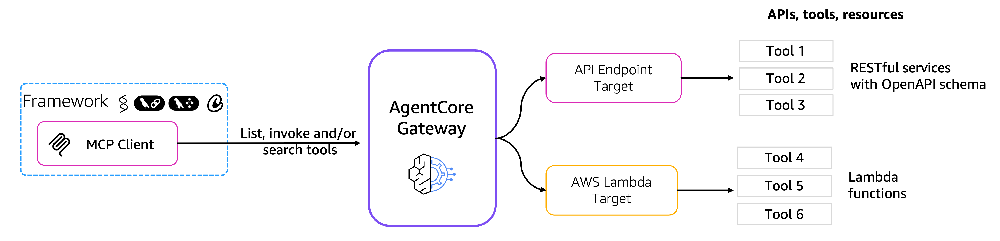

# Amazon Bedrock AgentCore Gateway

## Overview
Amazon Bedrock AgentCore Gateway provides customers a way to turn their existing APIs and Lambda functions into 
fully-managed MCP servers without needing to manage infra or hosting. 

Customers can bring OpenAPI specifications or Smithy models for their existing APIs, or add Lambda functions that 
front their tools. 

AgentCore Gateway provides a uniform MCP interface across all these tools including providing an OAuth interface for 
tools that do not support OAuth out of the box like AWS services.

### Tutorial Details

| Information         | Details                                                   |
|:--------------------|:----------------------------------------------------------|
| Tutorial type       | Interactive                                               |
| AgentCore Services  | AgentCore Gateway, AgentCore Identity                     |
| Agentic Framework   | Strands Agents                                            |
| LLM model           | Anthropic Claude Sonnet 3.7, Amazon Nova Pro              |
| Tutorial components | Creating AgentCore Gateway and Invoking AgentCore Gateway |
| Example complexity  | Easy                                                      |
| SDK used            | boto3                                                     |

### Tutorial Architecture

## Tutorial Key Features

### Secure Tool Access

Amazon Bedrock AgentCore Gateway complies with the [MCP authorization specification](https://modelcontextprotocol.io/specification/2025-06-18/basic/authorization) 
for the authorization of incoming MCP tool calls.

Amazon Bedrock AgentCore Gateway also offers 2 options to support authorization of the outgoing calls from Gateway:
* using IAM
* using API key or
* using OAuth access tokens 

You can configure the authorization using Credentials provider API of the Amazon Bedrock AgentCore Identity and 
attach them to the AgentCore Gateway Target. 

Each Target (Smithy and OpenAPI) can be attached to only 1 credentials provider.

### Searching for Tools
Amazon Bedrock AgentCore Gateway also includes a powerful built-in semantic search capability that helps agents and 
developers finding the most relevant tools through natural language queries, through **reducing the context** passed to your
agent for tool selection.

This search functionality is implemented as a prebuilt tool that leverages vector embeddings for semantic matching. 

Users can enable this feature during Gateway creation by opting in through the CreateGateway API. 

Once enabled, any subsequent CreateTarget operations automatically trigger the generation of vector embeddings for the target's tools. 
During this process, the CreateTarget response STATUS field will indicate "UPDATING" while embeddings are being generated

## Tutorials Overview

In these tutorials we will cover the following functionality:
