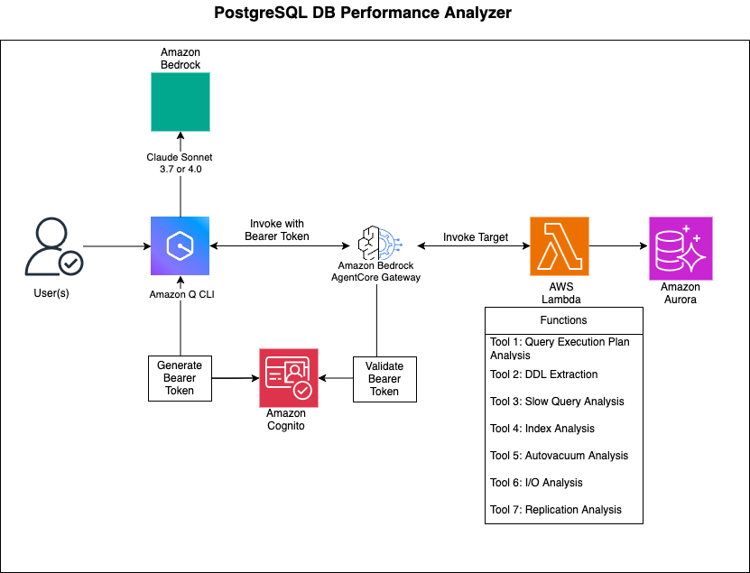

# PostgreSQL Database Performance Analysis Tools

This directory contains AWS Lambda-based tools for analyzing PostgreSQL database performance using Amazon Bedrock AgentCore. The tools provide comprehensive database analysis capabilities including query performance, DDL extraction, slow query analysis, and system health monitoring.

## Architecture Diagram




## Use Case Details

| Information | Details |
|-------------|---------|
| Use case | Analyzing PostgreSQL database performance using Amazon Bedrock AgentCore. The tools provide comprehensive database analysis capabilities including query performance, DDL extraction, slow query analysis, and system health monitoring.|
| Use case type | Conversational |
| Agent type | Single agent |
| Use case components | Tools, Gateway |
| Use case vertical | All Industries |
| Example complexity | Intermediate |
| SDK used | Amazon Bedrock AgentCore SDK, boto3 |

## Process Flow

1. **User Interaction**: Users interact with the database analysis tools through Amazon Q or other clients that support the MCP protocol.

2. **Request Processing**:
   - The request is sent to Amazon Bedrock AgentCore
   - AgentCore routes the request to the appropriate Gateway
   - The Gateway forwards the request to the Gateway Targets (Lambda functions)

3. **Analysis Execution**:
   - Lambda functions retrieve database credentials from AWS Secrets Manager
   - Functions connect to the PostgreSQL database (Aurora or RDS)
   - Analysis queries are executed based on the requested action type
   - Results are processed and formatted according to the MCP protocol

4. **Response Flow**:
   - Lambda functions return the analysis results to the Gateway
   - The Gateway forwards the response back to AgentCore
   - AgentCore delivers the response to the client

5. **Security & Configuration**:
   - Database credentials are securely stored in AWS Secrets Manager
   - Environment-specific configurations are managed via Parameter Store
   - All database connections use least-privilege access principles

## Components

### Lambda Functions
- **pg-analyze-performance.py** - Main Lambda function for query analysis, DDL extraction, and safe query execution
- **pgstat-analyse-database.py** - Lambda function for comprehensive database performance analysis using pg_stat_statements

### Gateway Configuration Scripts
- **create_gateway.py** - Creates the Bedrock Agent Core gateway with authentication
- **lambda-target-analyze-db-performance.py** - Registers the performance analysis Lambda target
- **lambda-target-analyze-db-slow-query.py** - Registers the slow query analysis Lambda target

### Dependencies
- **psycopg2-layer.zip** - Lambda layer containing psycopg2 library for PostgreSQL connectivity

## Features

### Performance Analysis Tools
1. **Query Execution Plan Analysis** - Analyzes and explains SQL query execution plans
2. **DDL Extraction** - Extracts Data Definition Language for database objects
3. **Safe Query Execution** - Executes read-only queries with safety constraints
4. **Slow Query Analysis** - Identifies and analyzes slow-running queries
5. **Connection Management** - Monitors database connections and identifies issues
6. **Index Analysis** - Analyzes index usage and identifies optimization opportunities
7. **Autovacuum Analysis** - Monitors vacuum operations and table bloat
8. **I/O Analysis** - Analyzes database I/O patterns and buffer usage
9. **Replication Analysis** - Monitors replication lag and status
10. **System Health** - Overall database health monitoring

## Prerequisites

### AWS Services Required
- **AWS Lambda** - Serverless compute for analysis functions
- **Amazon Bedrock Agent Core** - AI agent runtime and gateway capabilities
- **Amazon Aurora PostgreSQL** or **Amazon RDS PostgreSQL** - Target database for analysis
- **Amazon Cognito User Pool** - Authentication and user management
- **AWS Secrets Manager** - Secure storage of database credentials
- **AWS Systems Manager Parameter Store** - Configuration management
- **AWS IAM** - Identity and access management with appropriate roles and policies

### Authentication & Security Requirements
- **Cognito User Pool** with configured app client
- **Cognito Domain** (optional but recommended for hosted UI)
- **IAM Role** for Bedrock Agent Core Gateway with appropriate permissions
Attach the below policy to your IAM role
```
{
    "Version": "2012-10-17",
    "Statement": [
        {
            "Sid": "VisualEditor0",
            "Effect": "Allow",
            "Action": [
                "iam:PassRole",
                "bedrock-agentcore:*"
            ],
            "Resource": "*"
        }
    ]
}
```
- **Lambda Execution Role** with permissions for:
  - Secrets Manager access
  - Parameter Store access
  - VPC access (if database is in private subnet)
  - CloudWatch Logs

### Database Requirements
- **PostgreSQL 14+** (Aurora PostgreSQL or RDS PostgreSQL)
- **pg_stat_statements extension** enabled for performance analysis
- **Database user** with appropriate read permissions:
  - SELECT on system catalogs (pg_stat_*, information_schema)
  - CONNECT privilege on target databases
  - Usage on schemas being analyzed

### Network Requirements
- **VPC Configuration** - Lambda functions must have network access to database
- **Security Groups** - Proper ingress/egress rules for database connectivity
- **Subnets** - Lambda functions deployed in subnets with database access

## Setup Instructions

### 1. Environment Variables

Set the following environment variables for your Lambda functions:

#### Required Variables
```bash
# AWS Configuration
AWS_REGION=us-west-2
REGION=us-west-2

# Bedrock Agent Core
ENDPOINT_URL=https://bedrock-agentcore-control.us-west-2.amazonaws.com
GATEWAY_IDENTIFIER=your-gateway-identifier
LAMBDA_ARN=arn:aws:lambda:region:account:function:your-function-name

# Authentication (for gateway creation)
COGNITO_USERPOOL_ID=your-cognito-user-pool-id
COGNITO_APP_CLIENT_ID=your-cognito-app-client-id
ROLE_ARN=arn:aws:iam::account:role/your-gateway-role

# Optional Configuration
TARGET_NAME=pg-analyze-db-performance
TARGET_DESCRIPTION=PostgreSQL database performance analysis tool
GATEWAY_NAME=Aurora-Postgres-DB-Analyzer-Gateway
GATEWAY_DESCRIPTION=Aurora Postgres DB Analyzer Gateway
```

### 2. Database Secrets Configuration

Store database credentials in AWS Secrets Manager with the following format:
```json
{
  "host": "your-db-cluster-endpoint",
  "dbname": "your-database-name",
  "username": "your-db-username",
  "password": "your-db-password",
  "port": 5432
}
```

### 3. Parameter Store Configuration

Create SSM parameters for environment-specific secret names:
```bash
# For production environment
aws ssm put-parameter \
  --name "/AuroraOps/prod" \
  --value "your-prod-secret-name" \
  --type "String"

# For development environment
aws ssm put-parameter \
  --name "/AuroraOps/dev" \
  --value "your-dev-secret-name" \
  --type "String"
```

### 4. Lambda Function Deployment

1. **Create Lambda Layer**:
   ```bash
   aws lambda publish-layer-version \
     --layer-name psycopg2-layer \
     --zip-file fileb://psycopg2-layer.zip \
     --compatible-runtimes python3.9 python3.10 python3.11 python3.12
   ```

2. **Deploy Lambda Functions**:
   ```bash
   # Deploy performance analysis function
   aws lambda create-function \
     --function-name genesis-pg-analyseobjects-lambda \
     --runtime python3.12 \
     --role arn:aws:iam::account:role/lambda-execution-role \
     --handler pg-analyze-performance.lambda_handler \
     --zip-file fileb://function.zip \
     --layers arn:aws:lambda:region:account:layer:psycopg2-layer:1

   # Deploy slow query analysis function
   aws lambda create-function \
     --function-name pgstat-analyse-database \
     --runtime python3.12 \
     --role arn:aws:iam::account:role/lambda-execution-role \
     --handler pgstat-analyse-database.lambda_handler \
     --zip-file fileb://function.zip \
     --layers arn:aws:lambda:region:account:layer:psycopg2-layer:1
   ```

### 5. Gateway and Target Registration

1. **Create Gateway**:
   ```bash
   python create_gateway.py
   ```

2. **Register Lambda Targets**:
   ```bash
   python lambda-target-analyze-db-performance.py
   python lambda-target-analyze-db-slow-query.py
   ```

## Invoking tools using Q CLI
### Update the mcp.json file with this config 
```
cd ~/.aws/amazonq
vi mcp.json
## Update this json
{
  "mcpServers": {
    "<you_desired_mcp_server_name>": {
      "command": "npx",
      "timeout": 60000,
      "args": [
        "mcp-remote@latest",
        "https://<gateway id>.gateway.bedrock-agentcore.us-west-2.amazonaws.com/mcp",
        "--header",
        "Authorization: Bearer <Bearer token>"
      ]
    }
  }
}
```

## Usage Examples

### 1. Query Performance Analysis

**Explain Query Execution Plan**:
```json
{
  "environment": "dev",
  "action_type": "explain_query",
  "query": "SELECT * FROM users WHERE email = 'user@example.com'"
}
```

**Execute Safe Read-Only Query**:
```json
{
  "environment": "dev",
  "action_type": "execute_query",
  "query": "SELECT COUNT(*) FROM orders WHERE created_date >= '2024-01-01'"
}
```

**Extract DDL for Database Object**:
```json
{
  "environment": "dev",
  "action_type": "extract_ddl",
  "object_type": "table",
  "object_name": "users",
  "object_schema": "public"
}
```

### 2. Database Performance Analysis

**Analyze Slow Queries**:
```json
{
  "environment": "prod",
  "action_type": "slow_query"
}
```

**Check Connection Issues**:
```json
{
  "environment": "prod",
  "action_type": "connection_management_issues"
}
```

**Analyze Index Usage**:
```json
{
  "environment": "prod",
  "action_type": "index_analysis"
}
```

**Monitor Autovacuum**:
```json
{
  "environment": "prod",
  "action_type": "autovacuum_analysis"
}
```

**Analyze I/O Performance**:
```json
{
  "environment": "prod",
  "action_type": "io_analysis"
}
```

**Check Replication Status**:
```json
{
  "environment": "prod",
  "action_type": "replication_analysis"
}
```

**System Health Check**:
```json
{
  "environment": "prod",
  "action_type": "system_health"
}
```

## Testing

### 1. Local Testing

Test Lambda functions locally using AWS SAM:

```bash
# Test performance analysis function
sam local invoke -e test-events/explain-query.json

# Test slow query analysis function
sam local invoke -e test-events/slow-query.json
```

### 2. Integration Testing

Create test events in `test-events/` directory:

**test-events/explain-query.json**:
```json
{
  "environment": "dev",
  "action_type": "explain_query",
  "query": "SELECT version()"
}
```

**test-events/slow-query.json**:
```json
{
  "environment": "dev",
  "action_type": "slow_query"
}
```

### 3. End-to-End Testing

Test through Bedrock Agent Core:

```bash
# Test via AWS CLI
aws bedrock-agentcore-control invoke-gateway-target \
  --gateway-identifier your-gateway-id \
  --target-name pg-analyze-db-performance \
  --input '{"environment":"dev","action_type":"execute_query","query":"SELECT 1"}'
```

### 4. Performance Testing

Monitor Lambda function performance:
- Cold start times
- Memory usage
- Database connection times
- Query execution times

## Security Considerations

### Database Access
- Use least-privilege database users
- Implement read-only access for analysis functions
- Rotate database credentials regularly
- Use VPC endpoints for secure connectivity

### Lambda Security
- Enable encryption at rest and in transit
- Use IAM roles with minimal permissions
- Implement proper error handling to avoid information leakage
- Monitor function invocations and errors

### Network Security
- Deploy Lambda functions in private subnets
- Use security groups to restrict database access
- Implement VPC flow logs for monitoring

## Monitoring and Troubleshooting

### CloudWatch Metrics
Monitor the following metrics:
- Lambda function duration
- Error rates
- Database connection failures
- Memory utilization

### Common Issues

1. **Connection Timeouts**:
   - Check VPC configuration
   - Verify security group rules
   - Increase Lambda timeout settings

2. **Permission Errors**:
   - Verify IAM roles and policies
   - Check database user permissions
   - Validate Secrets Manager access

3. **Query Performance**:
   - Monitor database load
   - Check for long-running queries
   - Analyze execution plans

### Logging
Enable detailed logging for troubleshooting:
```python
import logging
logging.basicConfig(level=logging.INFO)
logger = logging.getLogger(__name__)
```

## License

This project is licensed under the MIT License - see the LICENSE file for details.