# SRE Agent - Multi-Agent Site Reliability Engineering Assistant

## Table of Contents

- [Overview](#overview)
- [Key Features](#key-features)
- [Architecture](#architecture)
- [Specialized Agents](#specialized-agents)
- [Getting Started](#getting-started)
- [Usage](#usage)
- [Configuration](#configuration)
- [Demo Environment](#demo-environment)
- [Example Use Cases](#example-use-cases)
- [Production Deployment](#production-deployment)
- [Verification of Results](#verification-of-results)
- [Development](#development)
- [License](#license)

## Overview

The SRE Agent is a multi-agent system for Site Reliability Engineers that helps investigate infrastructure issues. Built on the Model Context Protocol (MCP) and powered by Amazon Nova and Anthropic Claude models (Claude can be accessed through Amazon Bedrock or directly through Anthropic), this system uses specialized AI agents that collaborate to investigate issues, analyze logs, monitor performance metrics, and execute operational procedures. The AgentCore Gateway provides access to data sources and systems available as MCP tools.

The system provides an intelligent assistant that understands context, investigates issues, and provides actionable insights. It integrates with existing infrastructure APIs and provides a conversational interface for infrastructure operations.

## Key Features

**Multi-Agent Orchestration**
- Specialized agents collaborate on infrastructure investigations
- Each agent focuses on specific domains: Kubernetes, logs, metrics, or operational procedures
- Real-time streaming shows investigation progress and agent reasoning

**Conversational Interface**
- Single-query investigations for quick answers
- Interactive multi-turn conversations with context preservation
- Natural language queries for infrastructure operations

**Integration and Security**
- AgentCore Gateway provides secure API access with authentication
- Health monitoring and retry logic for reliable operations
- Unified interface abstracts multiple backend systems

**Documentation and Reporting**
- Markdown reports generated for each investigation
- Audit trail for investigation history
- Knowledge base for future reference

## Architecture

### SRE Agent with Amazon Bedrock AgentCore

```mermaid
graph TB
    subgraph "User Interface"
        U["🧑‍💻 SRE Engineer"]
        CLI["Command Line Interface"]
        U -->|"Natural Language Query"| CLI
    end

    subgraph "SRE Agent Core"
        SUP["🧭 Supervisor Agent<br/>Orchestration & Routing"]
        K8S["☸️ Kubernetes Agent<br/>Infrastructure Operations"]
        LOG["📊 Logs Agent<br/>Log Analysis & Search"]
        MET["📈 Metrics Agent<br/>Performance Monitoring"]
        RUN["📖 Runbooks Agent<br/>Operational Procedures"]
        
        CLI -->|"Query"| SUP
        SUP -->|"Route"| K8S
        SUP -->|"Route"| LOG
        SUP -->|"Route"| MET
        SUP -->|"Route"| RUN
    end

    subgraph "AgentCore Gateway"
        GW["🌉 AgentCore Gateway<br/>MCP Protocol Handler"]
        AUTH["🔐 Authentication<br/>Token Management"]
        HEALTH["❤️ Health Monitor<br/>Circuit Breaker"]
        
        subgraph "Infrastructure APIs"
            DK8S["Kubernetes API<br/>:8011"]
            DLOG["Logs API<br/>:8012"]
            DMET["Metrics API<br/>:8013"]
            DRUN["Runbooks API<br/>:8014"]
        end
        
        K8S -.->|"MCP"| GW
        LOG -.->|"MCP"| GW
        MET -.->|"MCP"| GW
        RUN -.->|"MCP"| GW
        
        GW --> AUTH
        GW --> HEALTH
        GW --> DK8S
        GW --> DLOG
        GW --> DMET
        GW --> DRUN
    end

    subgraph "Amazon Bedrock"
        CLAUDE["Claude 4 Sonnet<br/>Large Language Model"]
        SUP -.->|"LLM Calls"| CLAUDE
        K8S -.->|"LLM Calls"| CLAUDE
        LOG -.->|"LLM Calls"| CLAUDE
        MET -.->|"LLM Calls"| CLAUDE
        RUN -.->|"LLM Calls"| CLAUDE
    end

    classDef agent fill:#e1f5fe,stroke:#01579b,stroke-width:2px
    classDef gateway fill:#f3e5f5,stroke:#4a148c,stroke-width:2px
    classDef api fill:#e8f5e9,stroke:#1b5e20,stroke-width:2px
    classDef bedrock fill:#fff3e0,stroke:#e65100,stroke-width:2px
    
    class SUP,K8S,LOG,MET,RUN agent
    class GW,AUTH,HEALTH gateway
    class DK8S,DLOG,DMET,DRUN api
    class CLAUDE bedrock
```



### System Components

#### SRE Agent Core

Built on LangGraph, the core orchestrates multiple specialized agents. The Supervisor Agent coordinates investigations by analyzing queries and routing them to appropriate specialist agents. Each agent accesses domain-specific tools through the MCP protocol to interact with infrastructure APIs.

The collaboration model enables complex investigations across multiple domains. For example, investigating a pod failure might involve the Kubernetes Agent identifying resource constraints, the Metrics Agent providing historical analysis, and the Logs Agent correlating errors.

#### AgentCore Gateway

The gateway provides secure communication between AI agents and infrastructure APIs. Built on the Model Context Protocol (MCP), it offers:

- Standardized interface for tool discovery and execution
- Authentication through bearer tokens
- Circuit breakers for resilience
- Health monitoring for reliable operations
- Protocol translation and retry logic

#### Infrastructure Integration

The system works with both demo and production environments:

**Demo Environment**: Four specialized API servers simulate Kubernetes clusters, log aggregation systems, metrics databases, and operational procedures. This allows evaluation without impacting production systems.

**Production Environment**: The same agents connect to real infrastructure APIs through the AgentCore Gateway. Gateway configuration can be updated to point to production endpoints while maintaining the same agent logic.

## Specialized Agents

### Kubernetes Infrastructure Agent

Handles container orchestration and cluster operations. This agent investigates issues across pods, deployments, services, and nodes by examining cluster state, analyzing pod health, resource utilization, and recent events.

**Capabilities:**
- Check pod status across namespaces
- Examine deployment configurations and rollout history
- Investigate cluster events for anomalies
- Analyze resource usage patterns
- Monitor node health and capacity

### Application Logs Agent

Processes log data to find relevant information. This agent understands log patterns, identifies anomalies, and correlates events across multiple services.

**Capabilities:**
- Full-text search with regex support
- Error log aggregation and categorization
- Pattern detection for recurring issues
- Time-based correlation of events
- Statistical analysis of log volumes

### Performance Metrics Agent

Monitors system metrics and identifies performance issues. This agent understands relationships between different metrics and provides both real-time analysis and historical trending.

**Capabilities:**
- Application performance metrics (response times, throughput)
- Error rate analysis with thresholding
- Resource utilization metrics (CPU, memory, disk)
- Availability and uptime monitoring
- Trend analysis for capacity planning

### Operational Runbooks Agent

Provides access to documented procedures, troubleshooting guides, and best practices. This agent helps standardize incident response by retrieving relevant procedures based on the current situation.

**Capabilities:**
- Incident-specific playbooks for common scenarios
- Detailed troubleshooting guides with step-by-step instructions
- Escalation procedures with contact information
- Common resolution patterns for known issues
- Best practices for system operations

## Getting Started

### Prerequisites

> **⚠️ IMPORTANT:** Amazon Bedrock AgentCore Gateway **only works with HTTPS endpoints**. You must have valid SSL certificates for your backend servers.

Before installing the SRE Agent, ensure you have the following prerequisites in place:

#### System Requirements
- **Python 3.12 or higher** for optimal performance and compatibility
- **`uv` package manager** for fast, reliable Python package management
- **EC2 Instance**: We recommend a `t3.xlarge` instance or larger for running the SRE Agent backend servers

#### SSL Certificate Requirements
You **must** have valid SSL certificates for the machine running this solution. The AgentCore Gateway requires HTTPS endpoints for all backend services.

**SSL Certificate Setup:**
You need an HTTPS certificate and private key to proceed. If you use `your-backend-domain.com` as the domain for your backend servers, then you will need an SSL certificate for `your-backend-domain.com` and your services will be accessible to AgentCore Gateway as `https://your-backend-domain.com:8011`, `https://your-backend-domain.com:8012`, etc.

**Recommended Setup:**
1. **Use an EC2 instance** (recommended: `t3.xlarge`) with a public IP and domain name
2. **Generate SSL certificates using Let's Encrypt, no-ip, or other similar services**
3. **Place the SSL certificate and private key files** in `/etc/ssl/certs/` and `/etc/ssl/private/` folders respectively on your EC2 machine

**Example file locations:**
- SSL Certificate: `/etc/ssl/certs/fullchain.pem`
- Private Key: `/etc/ssl/private/privkey.pem`

**⚠️ Important: OpenAPI Specification Configuration**
Before starting the backend servers, you **must** update the OpenAPI specification files in `backend/openapi_specs/` to replace `https://your-backend-domain.com` with your actual domain name for which you have the SSL certificate. This is required because AgentCore needs a publicly reachable domain to connect to the backend services.

Update these files:
- `backend/openapi_specs/k8s_api.yaml`
- `backend/openapi_specs/logs_api.yaml`
- `backend/openapi_specs/metrics_api.yaml`
- `backend/openapi_specs/runbooks_api.yaml`

Replace `https://your-backend-domain.com:XXXX` with your actual domain (e.g., `https://mydomain.com:8011`).

#### AI Model Access
You'll need either:
- **Anthropic API key** for direct Claude access, OR
- **AWS credentials** configured for Amazon Bedrock access

The system is designed to work with Claude 3.5 Sonnet, which provides the best balance of performance and cost for infrastructure operations.

### Installation

```bash
# Clone the repository
git clone https://github.com/your-org/sre-agent
cd sre-agent

# Create and activate a virtual environment
uv venv --python 3.12
source .venv/bin/activate  # On Windows: .venv\Scripts\activate

# Install the SRE Agent and dependencies
uv pip install -e .
```

### Quick Start

The fastest way to experience the SRE Agent is through our demo environment, which provides realistic mock data without requiring access to real infrastructure.

> **📋 Note:** Ensure you have completed the SSL certificate setup from the Prerequisites section before proceeding.

```bash
# Step 1: Configure environment variables
cp .env.example sre_agent/.env
# Edit sre_agent/.env and add your Anthropic API key:
# ANTHROPIC_API_KEY=sk-ant-your-key-here

# Step 2: Update OpenAPI specifications with your domain
# Replace 'your-backend-domain.com' with your actual domain in all OpenAPI spec files
sed -i 's/your-backend-domain.com/mydomain.com/g' backend/openapi_specs/*.yaml
# Example: Replace 'mydomain.com' with your actual domain name

# Step 3: Get your EC2 instance private IP for server binding
# Get session token for IMDSv2
TOKEN=$(curl -X PUT "http://169.254.169.254/latest/api/token" \
  -H "X-aws-ec2-metadata-token-ttl-seconds: 21600" -s)

# Get private IP (for server binding)
PRIVATE_IP=$(curl -H "X-aws-ec2-metadata-token: $TOKEN" \
  -s http://169.254.169.254/latest/meta-data/local-ipv4)

echo "Private IP: $PRIVATE_IP"

# Step 4: Start the demo backend servers with SSL
cd backend
./scripts/start_demo_backend.sh \
  --host $PRIVATE_IP \
  --ssl-keyfile /etc/ssl/private/privkey.pem \
  --ssl-certfile /etc/ssl/certs/fullchain.pem
cd ..

# Step 5: Create and configure the AgentCore Gateway
cd gateway
./create_gateway.sh
./mcp_cmds.sh
cd ..

# Step 6: Update the gateway URI in agent configuration
# Copy the gateway URI to the agent config file
GATEWAY_URI=$(cat gateway/.gateway_uri)
sed -i "s|uri: \".*\"|uri: \"$GATEWAY_URI\"|" sre_agent/config/agent_config.yaml

# Step 7: Copy the gateway access token to your .env file
# Remove any existing GATEWAY_ACCESS_TOKEN line and add the new one
sed -i '/^GATEWAY_ACCESS_TOKEN=/d' sre_agent/.env
echo "GATEWAY_ACCESS_TOKEN=$(cat gateway/.access_token)" >> sre_agent/.env

# Alternative: Manual method
# Copy the URI from gateway/.gateway_uri and update sre_agent/config/agent_config.yaml manually
# Copy the token from gateway/.access_token and update sre_agent/.env manually:
# GATEWAY_ACCESS_TOKEN=<your_token_here>

# Step 8: Run your first investigation
sre-agent --prompt "What's the status of the database pods?"
```

The system will orchestrate multiple agents to investigate your query, showing real-time progress as each agent contributes its findings. You'll see the Kubernetes Agent checking pod status, the Logs Agent searching for errors, and other agents collaborating to provide a comprehensive analysis.

## Usage

### Interactive Mode

The interactive mode provides a conversational interface for ongoing investigations. This mode maintains context across multiple queries, allowing you to drill deeper into issues and ask follow-up questions based on previous findings:

```bash
sre-agent --interactive

# Available commands in interactive mode:
# /help     - Show available commands
# /agents   - List available specialist agents
# /history  - Show conversation history
# /save     - Save the current conversation
# /clear    - Clear conversation history
# /exit     - Exit the interactive session
```

Interactive mode is particularly useful for complex investigations where you need to explore multiple hypotheses or when the initial findings suggest deeper issues that require further analysis.

### Single Query Mode

For quick investigations or automation scenarios, you can use single query mode to get immediate answers:

```bash
# Investigate specific pod issues
sre-agent --prompt "Why are the payment-service pods crash looping?"

# Analyze performance degradation
sre-agent --prompt "Investigate high latency in the API gateway over the last hour"

# Search for error patterns
sre-agent --prompt "Find all database connection errors in the last 24 hours"

# Check healthy service status
sre-agent --prompt "How is the product catalog service performing?"
```

Each query triggers a complete investigation cycle, with the Supervisor Agent coordinating specialist agents to gather relevant information and provide actionable insights.

### Advanced Options

```bash
# Use a specific LLM provider
sre-agent --provider bedrock --query "Check cluster health"

# Save investigation reports to a custom directory
sre-agent --output-dir ./investigations --query "Analyze memory usage trends"

# Disable markdown report generation for scripting
sre-agent --no-markdown --query "Get current error rates"

# Use Amazon Bedrock with a specific profile
AWS_PROFILE=production sre-agent --provider bedrock --interactive
```

## Configuration

### Environment Variables

The SRE Agent uses environment variables for sensitive configuration values. Create a `.env` file in the `sre_agent/` directory with the following required variables:

```bash
# Required: API key for Claude model access
# For Anthropic direct access:
ANTHROPIC_API_KEY=sk-ant-api-key-here

# For Amazon Bedrock access:
AWS_DEFAULT_REGION=us-east-1
AWS_PROFILE=your-profile-name  # Or use AWS_ACCESS_KEY_ID and AWS_SECRET_ACCESS_KEY

# Required: AgentCore Gateway authentication
GATEWAY_ACCESS_TOKEN=your-gateway-token-here  # Generated by gateway setup

# Optional: Debugging and logging
LOG_LEVEL=INFO  # Options: DEBUG, INFO, WARNING, ERROR
DEBUG=false     # Enable debug mode for verbose output
```

**Note**: The SRE Agent looks for the `.env` file in the `sre_agent/` directory, not the project root. This allows for modular configuration management.

### Agent Configuration

The agent behavior is configured through `sre_agent/config/agent_config.yaml`. This file defines the mapping between agents and their available tools, as well as LLM parameters:

```yaml
# Agent to tool mapping
agents:
  kubernetes_agent:
    name: "Kubernetes Infrastructure Agent"
    description: "Specializes in Kubernetes operations and troubleshooting"
    tools:
      - get_pod_status
      - get_deployment_status
      - get_cluster_events
      - get_resource_usage
      - get_node_status

  logs_agent:
    name: "Application Logs Agent"
    description: "Expert in log analysis and pattern detection"
    tools:
      - search_logs
      - get_error_logs
      - analyze_log_patterns
      - get_recent_logs
      - count_log_events

  metrics_agent:
    name: "Performance Metrics Agent"
    description: "Analyzes performance metrics and trends"
    tools:
      - get_performance_metrics
      - get_error_rates
      - get_resource_metrics
      - get_availability_metrics
      - analyze_trends

  runbooks_agent:
    name: "Operational Runbooks Agent"
    description: "Provides operational procedures and guides"
    tools:
      - search_runbooks
      - get_incident_playbook
      - get_troubleshooting_guide
      - get_escalation_procedures
      - get_common_resolutions

# Global tools available to all agents
global_tools:
  - get_current_time  # Local tool for timestamp operations

# LLM configuration
llm:
  provider: anthropic  # Options: anthropic, bedrock
  model_id: claude-3-5-sonnet-20241022
  temperature: 0.1     # Low temperature for consistent technical responses
  max_tokens: 4096     # Maximum response length
  
# Gateway configuration
gateway:
  uri: "https://your-gateway-url.com"  # Updated during setup
```

### Gateway Configuration

The AgentCore Gateway is configured through `gateway/config.yaml`. This configuration is managed by the setup scripts but can be customized:

```yaml
# AgentCore Gateway Configuration Template
# Copy this file to config.yaml and update with your environment-specific settings

# AWS Configuration
account_id: "YOUR_ACCOUNT_ID"
region: "us-east-1"
role_name: "YOUR_ROLE_NAME"
endpoint_url: "https://bedrock-agentcore-control.us-east-1.amazonaws.com"
credential_provider_endpoint_url: "https://us-east-1.prod.agent-credential-provider.cognito.aws.dev"

# Cognito Configuration
user_pool_id: "YOUR_USER_POOL_ID"
client_id: "YOUR_CLIENT_ID"

# S3 Configuration
s3_bucket: "your-agentcore-schemas-bucket"
s3_path_prefix: "devops-multiagent-demo"  # Path prefix for OpenAPI schema files

# Provider Configuration
# This ARN is automatically generated by create_gateway.sh when it runs create_credentials_provider.py
provider_arn: "arn:aws:bedrock-agentcore:REGION:ACCOUNT_ID:token-vault/default/apikeycredentialprovider/YOUR_PROVIDER_NAME"

# Gateway Configuration
gateway_name: "MyAgentCoreGateway"
gateway_description: "AgentCore Gateway for API Integration"

# Target Configuration
target_description: "S3 target for OpenAPI schema"
```

## Demo Environment

The SRE Agent includes a demo environment that simulates infrastructure operations. This allows you to explore the system's capabilities without connecting to production systems.

**Important Note**: The data in [`backend/data`](backend/data) is synthetically generated, and the backend directory contains stub servers that showcase how a real SRE agent backend could work. In a production environment, these implementations would need to be replaced with real implementations that connect to actual systems, use vector databases, and integrate with other data sources. This demo serves as an illustration of the architecture, where the backend components are designed to be plug-and-play replaceable.

### Starting the Demo Backend

> **🔒 SSL Requirement:** The backend servers must run with HTTPS when using AgentCore Gateway. Use the SSL commands from the Quick Start section.

The demo backend consists of four specialized API servers that provide realistic responses for different infrastructure domains:

```bash
# Start all demo servers with SSL (recommended)
cd backend

# Get your private IP for server binding
TOKEN=$(curl -X PUT "http://169.254.169.254/latest/api/token" \
  -H "X-aws-ec2-metadata-token-ttl-seconds: 21600" -s)
PRIVATE_IP=$(curl -H "X-aws-ec2-metadata-token: $TOKEN" \
  -s http://169.254.169.254/latest/meta-data/local-ipv4)

# Start with SSL certificates
./scripts/start_demo_backend.sh \
  --host $PRIVATE_IP \
  --ssl-keyfile /etc/ssl/private/privkey.pem \
  --ssl-certfile /etc/ssl/certs/fullchain.pem

# Alternative: Start without SSL (testing only - not compatible with AgentCore Gateway)
# ./scripts/start_demo_backend.sh --host 0.0.0.0

# The script starts four API servers:
# - Kubernetes API (port 8011): Simulates a K8s cluster with multiple namespaces
# - Logs API (port 8012): Provides searchable application logs with error injection
# - Metrics API (port 8013): Generates realistic performance metrics with anomalies
# - Runbooks API (port 8014): Serves operational procedures and troubleshooting guides
```

### Demo Scenarios

The demo environment includes several pre-configured scenarios that showcase the SRE Agent's capabilities:

**Database Pod Failure Scenario**: The demo includes failing database pods in the production namespace with associated error logs and resource exhaustion metrics. This scenario demonstrates how the agents collaborate to identify memory leaks as the root cause.

**API Gateway Latency Scenario**: Simulated high latency in the API gateway with corresponding slow query logs and CPU spikes. This showcases the system's ability to correlate issues across different data sources.

**Cascading Failure Scenario**: A complex scenario where a failing authentication service causes cascading failures across multiple services. This demonstrates the agent's ability to trace issues through distributed systems.

### Customizing Demo Data

The demo data is stored in JSON files under `backend/data/` and can be customized to match your specific use cases:

```bash
backend/data/
├── k8s_data/
│   ├── pods.json         # Pod definitions and status
│   ├── deployments.json  # Deployment configurations
│   └── events.json       # Cluster events
├── logs_data/
│   └── application_logs.json  # Log entries with various severity levels
├── metrics_data/
│   └── performance_metrics.json  # Time-series metrics data
└── runbooks_data/
    └── runbooks.json     # Operational procedures
```

### Stopping the Demo

```bash
# Stop all demo servers
cd backend
./scripts/stop_demo_backend.sh
```

## Example Use Cases

### Investigating Pod Failures

When database pods start failing, the SRE Agent orchestrates a comprehensive investigation:

```bash
sre-agent --prompt "Our database pods are crash looping in production"
```

The investigation unfolds systematically: The Supervisor Agent first engages the Kubernetes Agent to check pod status and recent events. Upon discovering OOMKilled events, it automatically involves the Metrics Agent to analyze memory usage trends over time. The Logs Agent searches for memory-related errors and identifies queries causing excessive memory allocation. Finally, the Runbooks Agent provides specific remediation steps, including query optimization guidelines and pod resource adjustments.

This investigation typically completes in under 30 seconds, providing actionable insights that would traditionally require manual correlation across multiple tools and dashboards.

### Diagnosing Performance Issues

For performance-related investigations, the agent system excels at correlating metrics across multiple dimensions:

```bash
sre-agent --prompt "API response times have degraded 3x in the last hour"
```

The multi-agent collaboration reveals the complete picture: The Metrics Agent identifies the exact time when latency increased and correlates it with CPU usage patterns. The Logs Agent discovers database connection pool exhaustion errors coinciding with the performance degradation. The Kubernetes Agent finds that a recent deployment increased replica count but not database connections. The Runbooks Agent provides the specific configuration changes needed to resolve the issue.

### Interactive Troubleshooting Session

For complex issues requiring iterative investigation, the interactive mode provides a powerful interface:

```bash
sre-agent --interactive

👤 You: We're seeing intermittent 502 errors from the payment service
🤖 Multi-Agent System: Investigating intermittent 502 errors...

[Agents collaborate to analyze load balancer logs, pod health, and network policies]

💬 Final Response: Found that payment service pods are being terminated due to 
failed liveness probes during high load. The health check endpoint is timing 
out when payment processing queues exceed 1000 items.

👤 You: What's causing the queue buildup?
🤖 Multi-Agent System: Analyzing payment queue patterns...

[Deeper investigation into message processing rates and database performance]

💬 Final Response: Database analysis shows lock contention on the payments table
during batch processing. The account_balance update triggers are causing 
row-level locks that block payment processing...
```

### Proactive Monitoring

The SRE Agent can also be used for proactive health checks and trend analysis:

```bash
# Morning health check
sre-agent --prompt "Perform a comprehensive health check of all production services"

# Capacity planning
sre-agent --prompt "Analyze resource utilization trends and predict when we'll need to scale"

# Security audit
sre-agent --prompt "Check for any suspicious patterns in authentication logs"
```

## Production Deployment

### Infrastructure Requirements

For production deployment, the SRE Agent can be deployed in multiple ways depending on your operational requirements:

**Self-Managed Deployment**: The system is designed to be stateless and can be deployed as a containerized service or directly on virtual machines. Minimum requirements include Python 3.12+ runtime environment, 4GB RAM for agent orchestration (8GB recommended for high-volume operations), network access to infrastructure APIs and Amazon Bedrock endpoints, and secure storage for API credentials and tokens.

**Amazon Bedrock AgentCore Runtime (Recommended)**: For a fully managed experience, the SRE Agent can be deployed through Amazon Bedrock AgentCore Runtime, which provides a serverless, auto-scaling environment. This eliminates infrastructure management overhead, automatically scales based on investigation workload, and provides built-in security, monitoring, and cost optimization. The AgentCore Runtime handles agent orchestration, memory management, and provides enterprise-grade availability without requiring manual capacity planning or server maintenance.

### Security Considerations

The SRE Agent handles sensitive infrastructure data and requires appropriate security measures. Implement API authentication using OAuth2 or API keys for all infrastructure endpoints. Use AWS IAM roles for Bedrock access instead of long-lived credentials. Enable TLS encryption for all API communications. Implement audit logging for all agent actions and investigations. Use secret management systems (AWS Secrets Manager) for credential storage.


## Verification of Results

The SRE Agent includes tools for verifying that investigation results are accurate and based on actual data rather than hallucinated information.

### Ground Truth Verification

For result verification, we provide a data dump utility that creates a comprehensive ground truth dataset:

```bash
# Generate complete data dump for verification
cd backend/scripts
./dump_data_contents.sh
```

This script processes all files in the [`backend/data`](backend/data) directory (including `.json`, `.txt`, and `.log` files) and creates a comprehensive dump at [`backend/data/all_data_dump.txt`](backend/data/all_data_dump.txt). This file serves as ground truth for verifying that agent responses are factual and not fabricated.

### Report Verification

The [`reports`](reports) folder contains investigation reports for several example queries. You can verify these reports against the ground truth data using the LLM-as-a-judge verification system:

```bash
# Verify a specific report against ground truth
python verify_report.py --report reports/example_report.md --ground-truth backend/data/all_data_dump.txt
```

### Example Verification Workflow

```bash
# 1. Generate an investigation report
sre-agent --prompt "Why are the payment-service pods crash looping?"

# 2. Create ground truth data dump
cd backend/scripts && ./dump_data_contents.sh && cd ../..

# 3. Verify the report contains only factual information
python verify_report.py --report reports/your_report_.md --ground-truth backend/data/all_data_dump.txt
```

>**⚠️ Important Note**: The system prompts and agent logic in [`sre_agent/agent_nodes.py`](sre_agent/agent_nodes.py) require further refinement before production use. This implementation demonstrates the architectural approach and provides a foundation for building production-ready SRE agents, but the prompts, error handling, and agent coordination logic need additional tuning for real-world reliability.

## Development

### Running Tests

The SRE Agent includes comprehensive test coverage to ensure reliability:

```bash
# Run all tests
pytest

# Run tests with coverage report
pytest --cov=sre_agent --cov-report=html
open htmlcov/index.html  # View coverage report

# Run specific test categories
pytest tests/unit/          # Fast unit tests
pytest tests/integration/   # Integration tests with mocked APIs
pytest tests/e2e/          # End-to-end tests with demo backend

# Run tests in parallel for speed
pytest -n auto

# Run with verbose output for debugging
pytest -vv -s
```

### Code Quality

Maintain code quality using automated tools:

```bash
# Format code with black
black sre_agent/ tests/

# Check type hints with mypy
mypy sre_agent/

# Lint code with ruff
ruff check sre_agent/

# Run all quality checks
make quality
```

### Contributing

We welcome contributions to improve the SRE Agent. Before submitting a pull request, please:

1. Review existing issues and discussions to avoid duplicate work
2. Create an issue describing your proposed changes for discussion
3. Follow the existing code style and patterns
4. Add tests for new functionality
5. Update documentation as needed
6. Ensure all tests pass and quality checks succeed

For major changes, please open an RFC (Request for Comments) issue first to discuss the proposed architecture and implementation approach.

## License

The SRE Agent is open source software licensed under the MIT License. See the [LICENSE](../../../LICENSE) file for full details.


