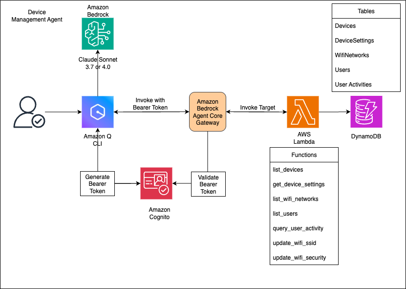

# Device Management Lambda

This AWS Lambda function implements all the MCP server tools from the Device Management MCP system in a single Lambda function. It provides a unified interface for managing IoT devices, WiFi networks, users, and activities through AWS Lambda.

## Architecture Diagram



## Process Flow

1. **User Interaction**: Users interact with the Device Management system through Amazon Q or other clients that support the MCP protocol.

2. **Request Processing**:
   - The request is sent to Amazon Bedrock AgentCore
   - AgentCore routes the request to the appropriate Gateway
   - The Gateway forwards the request to the Gateway Target (Lambda function)

3. **Tool Execution**:
   - The Lambda function receives the request and identifies the appropriate tool to execute
   - The function interacts with DynamoDB tables to perform CRUD operations
   - Results are processed and formatted according to the MCP protocol

4. **Response Flow**:
   - The Lambda function returns the response to the Gateway
   - The Gateway forwards the response back to AgentCore
   - AgentCore delivers the response to the client

5. **Data Flow**: All device data, user information, and configuration settings are stored in and retrieved from DynamoDB tables.

## Overview

The Device Management Lambda function provides the following capabilities:

- List devices in the system
- Get device settings
- List WiFi networks for a device
- Update WiFi network settings (SSID, security type)
- List users within an account
- Query user activity within a time period

## Files

- `lambda_function.py`: Main Lambda handler that implements all MCP tools
- `dynamodb_models.py`: DynamoDB table definitions and initialization
- `synthetic_data.py`: Script to generate synthetic test data
- `requirements.txt`: Python dependencies
- `deploy.sh`: Deployment script for the Lambda function
- `create_gateway.py`: Script to create a gateway for the MCP server
- `device-management-target.py`: Script to create a gateway target for the Lambda function
- `.env`: Environment variables configuration file
- `test_lambda.py`: Script to test the Lambda function locally

## Setup and Deployment

### 1. Environment Configuration

Create a `.env` file in the project root with the following variables:

```
# AWS and endpoint configuration
AWS_REGION=us-west-2
ENDPOINT_URL=https://bedrock-agentcore-control.us-west-2.amazonaws.com

# Lambda configuration
LAMBDA_ARN=arn:aws:lambda:us-west-2:your-account-id:function:DeviceManagementLambda

# Target configuration
GATEWAY_IDENTIFIER=your-gateway-identifier
TARGET_NAME=device-management-target
TARGET_DESCRIPTION=List, Update device management activities

# Gateway creation configuration
COGNITO_USERPOOL_ID=your-cognito-userpool-id
COGNITO_APP_CLIENT_ID=your-cognito-app-client-id
GATEWAY_NAME=Device-Management-Gateway
ROLE_ARN=arn:aws:iam::your-account-id:role/YourGatewayRole
GATEWAY_DESCRIPTION=Device Management Gateway
```

### 2. Install Dependencies

Install the required Python packages:

```bash
pip install -r requirements.txt
```

### 3. Deploy the Lambda Function

You can deploy the Lambda function using the provided deployment script:

```bash
chmod +x deploy.sh
./deploy.sh
```

The deployment script performs the following actions:
- Packages the Lambda function code with dependencies
- Creates an IAM role with necessary permissions (if it doesn't exist)
- Creates or updates the Lambda function
- Configures the function with appropriate memory and timeout settings

### 4. Create a Gateway (Optional if you want to use the existing gateway)

#### Pre-Requisites:
You IAM role should have access to the below policy
```
{
    "Version": "2012-10-17",
    "Statement": [
        {
            "Sid": "VisualEditor0",
            "Effect": "Allow",
            "Action": [
                "iam:PassRole",
                "bedrock-agentcore:*"
            ],
            "Resource": "*"
        }
    ]
}
```

If you need to create a new gateway for the MCP server, use the provided script:

```bash
python create_gateway.py
```

This script:
- Loads configuration from the `.env` file
- Creates a gateway in Amazon Bedrock with Cognito authentication
- Outputs the Gateway ID upon successful creation

Make sure to update the following variables in your `.env` file before running this script:
- `COGNITO_USERPOOL_ID`: Your Cognito User Pool ID
- `COGNITO_APP_CLIENT_ID`: Your Cognito App Client ID
- `ROLE_ARN`: The IAM role ARN with permissions to manage gateways
- `GATEWAY_NAME`: Name for your new gateway
- `GATEWAY_DESCRIPTION`: Description for your new gateway

### 5. Create Gateway Target

After deploying the Lambda function, create a gateway target to expose the function as an MCP server:

```bash
python device-management-target.py
```

This script:
- Loads configuration from the `.env` file
- Creates a gateway target in Amazon Bedrock using the Lambda function
- Configures the tool schema for all available operations
- Outputs the Target ID upon successful creation

### 6. DynamoDB Tables

The function uses the following DynamoDB tables in the configured AWS region:

- `Devices`: Device inventory and status
- `DeviceSettings`: Device configuration settings
- `WifiNetworks`: WiFi network configurations
- `Users`: User accounts and profiles
- `UserActivities`: User activity logs

These tables should already exist with your data.

### 7. Generate Test Data (Optional)

To populate the tables with synthetic test data:

```bash
python synthetic_data.py
```

### 8. Test the Lambda Function

You can test the Lambda function locally using the provided test script:

```bash
python test_lambda.py
```

This script tests all available tools and verifies that they work correctly.

## IAM Permissions

The Lambda function requires the following IAM permissions:

```json
{
  "Version": "2012-10-17",
  "Statement": [
    {
      "Effect": "Allow",
      "Action": [
        "dynamodb:GetItem",
        "dynamodb:Query",
        "dynamodb:Scan",
        "dynamodb:UpdateItem"
      ],
      "Resource": [
        "arn:aws:dynamodb:us-west-2:*:table/Devices",
        "arn:aws:dynamodb:us-west-2:*:table/DeviceSettings",
        "arn:aws:dynamodb:us-west-2:*:table/WifiNetworks",
        "arn:aws:dynamodb:us-west-2:*:table/Users",
        "arn:aws:dynamodb:us-west-2:*:table/UserActivities",
        "arn:aws:dynamodb:us-west-2:*:table/UserActivities/index/ActivityTypeIndex"
      ]
    }
  ]
}
```

The deployment script automatically creates this role and attaches the necessary policies.

## Available MCP Tools

The Lambda function exposes the following MCP tools:

1. `list_devices`: Lists all devices in the system
2. `get_device_settings`: Retrieves settings for a specific device
3. `list_wifi_networks`: Lists WiFi networks for a specific device
4. `list_users`: Lists all users in the system
5. `query_user_activity`: Queries user activity within a time period
6. `update_wifi_ssid`: Updates the SSID for a WiFi network
7. `update_wifi_security`: Updates the security type for a WiFi network

## Invoking tools using Q CLI
### Update the mcp.json file with this config 
```
cd ~/.aws/amazonq
vi mcp.json
## Update this json
{
  "mcpServers": {
    "<you_desired_mcp_server_name>": {
      "command": "npx",
      "timeout": 60000,
      "args": [
        "mcp-remote@latest",
        "https://<gateway id>.gateway.bedrock-agentcore.us-west-2.amazonaws.com/mcp",
        "--header",
        "Authorization: Bearer <Bearer token>"
      ]
    }
  }
}
```

## Troubleshooting

- **Missing environment variables**: Ensure all required variables are set in the `.env` file
- **Lambda deployment failures**: Check AWS IAM permissions and Lambda service quotas
- **Gateway creation failures**: Verify the Cognito User Pool ID, App Client ID, and IAM role ARN
- **Gateway target creation failures**: Verify the gateway identifier and Lambda ARN are correct
- **DynamoDB access issues**: Confirm the Lambda execution role has the necessary permissions

## Dependencies

- boto3
- python-dateutil
- python-dotenv

## Security Considerations

- The Lambda function should be deployed with the principle of least privilege
- Consider using AWS Secrets Manager for sensitive configuration values
- Implement appropriate authentication and authorization for API access
- Review and rotate IAM credentials regularly
- Ensure Cognito User Pool is configured with appropriate security settings
