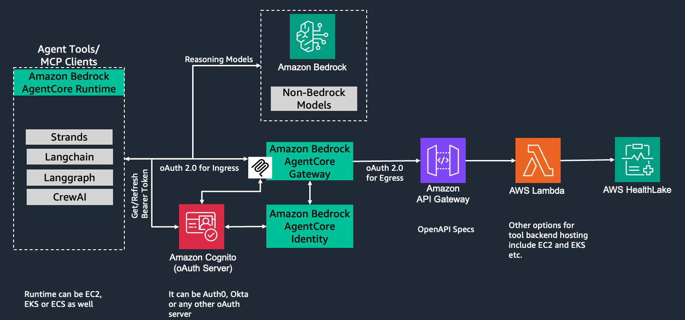
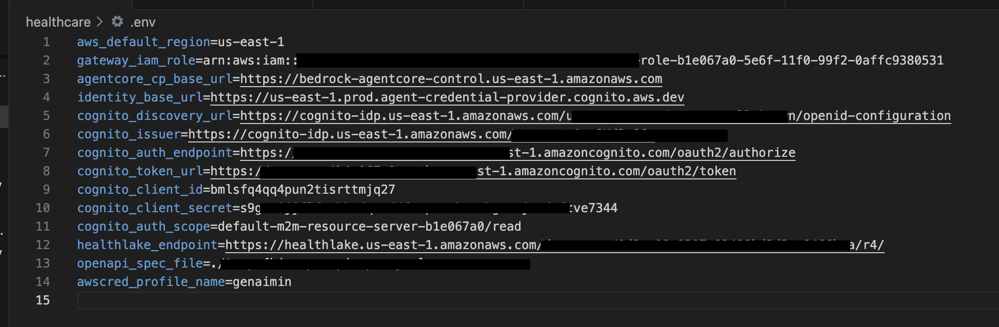

# Healthcare use case with Amazon Bedrock AgentCore Gateway
An AI agent for immunization related healthcare appointments built with **Amazon Bedrock AgentCore Gateway** using the **Model Context Protocol (MCP)** to expose the tools. This AI agent supports enquiring about current immunization status/schedule, checking appointment slots and booking appointments. It also provides personalized experience by knowing the logged in user (adult) and his/her children in the **FHIR R4** (Fast Healthcare Interoperability Resources) database.

## Overview


## Pre-requisites
**All of these steps are designed to work in us-east-1 and us-west-2 regions.**

### Required IAM Policies
Please ensure the required IAM permissions. Ignore if running this sample from Admin role.

Cloudformation stack used in this sample has AWS Healthlake, Cognito, S3, IAM Roles, API Gateway, Lambda functions related sources.

As a quick start, you may use the combination of AWS managed IAM policies and an Inline policy to avoid issues in deploying and setting up this code sample. However it is recommended to follow the principle of privilege in production.

**AWS managed IAM policies:**
* AmazonAPIGatewayAdministrator
* AmazonCognitoPowerUser
* AmazonHealthLakeFullAccess
* AmazonS3FullAccess
* AWSCloudFormationFullAccess
* AWSKeyManagementServicePowerUser
* AWSLakeFormationDataAdmin
* AWSLambda_FullAccess
* AWSResourceAccessManagerFullAccess
* CloudWatchFullAccessV2
* AmazonBedrockFullAccess

**Inline Policy:**
```
{
	"Version": "2012-10-17",
	"Statement": [
		{
			"Effect": "Allow",
			"Action": [
				"s3:GetObject",
				"s3:PutObject"
			],
			"Resource": [
				"arn:aws:s3:::amzn-s3-demo-source-bucket/*",
				"arn:aws:s3:::amzn-s3-demo-logging-bucket/*"
			]
		},
		{
			"Effect": "Allow",
			"Action": [
				"ram:GetResourceShareInvitations",
				"ram:AcceptResourceShareInvitation",
				"glue:CreateDatabase",
				"glue:DeleteDatabase"
			],
			"Resource": "*"
		},
		{
			"Effect": "Allow",
			"Action": [
				"bedrock-agentcore:*",
				"agent-credential-provider:*"
			],
			"Resource": "*"
		}
	]
}
```

* Python 3.12
* GIT
* AWS CLI 2.x
* Claude 3.5 Sonnet model enabled on Amazon Bedrock. Please follow this [guide](https://docs.aws.amazon.com/bedrock/latest/userguide/model-access-modify.html) to set up the same.

## Get the codebase
Clone the GIT repository OR download and extract the zip file provided to you.

```
git clone <repository-url>
cd ./02-use-cases/05-Healthcare-Appointment-Agent/
```

## Setup Infrastructure
Create an S3 bucket (**ignore if you would like to use an existing bucket**)

```
aws s3api create-bucket --bucket <globally unique bucket name here>
```

Push the lambda zip package to S3 bucket
```
aws s3 cp "./cloudformation/fhir-openapi-searchpatient.zip" s3://<bucket name here>/lambda_code/fhir-openapi-searchpatient.zip
```

Deploy cloudformation template by using below steps. The stack will take around 10 minutes. You can monitor the progress of stack by following this [guide](https://docs.aws.amazon.com/AWSCloudFormation/latest/UserGuide/monitor-stack-progress.html).
```
aws cloudformation create-stack \
  --stack-name healthcare-cfn-stack \
  --template-body file://cloudformation/healthcare-cfn.yaml \
  --capabilities CAPABILITY_NAMED_IAM \
  --region <us-east-1 or us-west-2> \
  --parameters ParameterKey=LambdaS3Bucket,ParameterValue="<bucket name here>" \
               ParameterKey=LambdaS3Key,ParameterValue="lambda_code/fhir-openapi-searchpatient.zip"
```

Install UV as per this [guide](https://docs.astral.sh/uv/getting-started/installation/)

Create and activate virtual environment

```
uv venv --python 3.12
source ./.venv/bin/activate
```

Unzip the latest AWS SDK wheels provided to you and copy in local_wheels directory.

Install dependencies

```
uv pip install -r requirements.txt
```

Initialize the environment by running below command. This will create an **.env** file which would be used for environment variables. Use the same region name as what was used with Cloudformation template above. Note down **APIEndpoint** as returned in the output.

```
python init_env.py \
--cfn_name healthcare-cfn-stack \
--openapi_spec_file ./fhir-openapi-spec.yaml \
--region <us-east-1 or us-west-2>
```

if you need to use a named credential profile then same can be achieved with below.

```
python init_env.py \
--cfn_name healthcare-cfn-stack \
--region <us-east-1 or us-west-2> \
--openapi_spec_file ./fhir-openapi-spec.yaml \
--profile <profile-name here>>
```

The **.env** file should look like below.


## Create some test data in AWS Healthlake
Run the below python program to ingest the test data as present in **test_data** folder. It may take around ~5 minutes to complete.
```
python create_test_data.py
```

## Create Bedrock AgentCore Gateway and Gateway Target
Open the OpenAPI spec file **fhir-openapi-spec.yaml** and replace **<your API endpoint here>** with **APIEndpoint** as noted down earlier.

Set up Bedrock AgentCore Gateway and Gateway Target based on OpenAPI specification in **fhir-openapi-spec.yaml** file. Note down the Gaeway Id from the output as it would be needed in later steps.

```
python setup_fhir_mcp.py --op_type Create --gateway_name <gateway_name_here>
```

## Test with MCP Client
Run Strands Agent by using below steps.

```
python test_fhir_mcp.py --gateway_id <gateway_id_here>
```

## Test with Strands Agent
Run Strands Agent by using below steps.

```
python strands_agent.py --gateway_id <gateway_id_here>
```

## Test with Langgraph Agent
Run Strands Agent by using below steps.

```
python langgraph_agent.py --gateway_id <gateway_id_here>
```

## Sample prompts to interact with Agent:
* How can you help?
* Let us check for immunization schedule first
* Please find slots for MMR vaccine around the scheduled date


